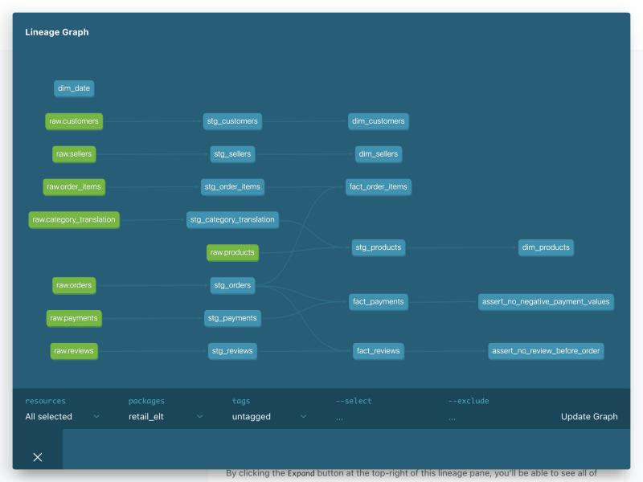

# Retail ELT Pipeline

A small but real ELT pipeline — simulated monthly landing zone → Airflow
orchestration → dbt transformations with tests → a queryable DuckDB
warehouse — running entirely locally with `docker compose up`.

```bash
git clone <this-repo>
cd retail-elt-pipeline
python3 -m venv .venv && source .venv/bin/activate && pip install -r requirements.txt
python3 data/partition_landing_zone.py --source /path/to/raw/olist/csvs   # see data/README.md
docker compose up --build
```

Then open the Airflow UI at `http://localhost:8080` (user/pass: `admin`/`admin`)
and trigger the `retail_elt_pipeline` DAG.

This is the fifth project in a portfolio that otherwise proves "I can model
data and build on top of a warehouse" (a CV classifier, an NL2SQL layer, a
fraud model, an A/B testing tool). This one proves a different skill: **I can
build the pipeline that fills the warehouse in the first place.** It reuses
the Olist retail dataset from the delivery-risk and NL2SQL projects, but the
point of this repo is the pipeline, not the analysis on top of it.

## What it does

Raw Olist exports were split into a simulated monthly landing zone (see
[data/README.md](data/README.md)) — one CSV per source table per month,
exactly like a real system dropping daily/monthly extracts. From there:

1. **Airflow** loads whichever monthly partitions have landed into raw
   tables in DuckDB — idempotently, so re-running a month never duplicates
   rows.
2. **dbt** cleans each raw table into a staging model (types cast, names
   standardized, nulls handled explicitly), then rebuilds a star schema
   (`fact_order_items`, `fact_payments`, `fact_reviews`, `dim_customers`,
   `dim_products`, `dim_sellers`, `dim_date`) on top of staging.
3. **dbt tests** (51 of them — schema tests plus two custom singular tests)
   run as part of the same `dbt build`, which stops on the first failing
   test. A bad row anywhere fails the DAG run, not just a log line.

## Architecture

```
landing/{orders,order_items,payments,reviews}/*.csv   (25 monthly partitions each)
seed/{customers,sellers,products,category_translation}.csv   (landed whole)
        │
        ▼  Airflow (one load task per table, idempotent DELETE+INSERT per partition)
raw.*  (DuckDB)
        │
        ▼  dbt build — staging models (1:1 cleanup)
staging.stg_*
        │
        ▼  dbt build — mart models (star schema)
marts.{fact_order_items, fact_payments, fact_reviews, dim_customers, dim_products, dim_sellers, dim_date}
        │
        ▼  dbt build — schema + singular tests (51 tests, fails the run on any failure)
```

The dbt-generated lineage graph makes this same flow visible without reading
any code:



*(green = sources, blue = models, generated with `dbt docs generate` /
`dbt docs serve`.)*

## Engineering decisions

**Idempotency.** Each load task is a `DELETE FROM raw.<table> WHERE
_partition_month = ?` followed by an `INSERT` for that month — not a blind
append — so re-triggering the DAG for a month that already landed replaces
that month's rows instead of duplicating them. This isn't just asserted:
[`tests/test_idempotency.py`](tests/test_idempotency.py) loads the same
fixture landing zone twice and fails if any raw table's row count moves.
Real run against the full dataset:

```
before rerun: (6512,)
--- reloading same month ---
  orders [2018-08]: 6512 rows (idempotent replace)
  ...
after rerun: (6512,)
total orders: (99441,)
```

**A failed test fails the run.** The DAG runs `dbt build` (not `dbt run` +
`dbt test` as two unlinked tasks), which stops on the first failing test and
returns a non-zero exit code — so a `BashOperator` task, and therefore the
whole DAG run, fails with it. No silent pass-through.

**Proving the quality gate is real.**
[`scripts/inject_bad_row.py`](scripts/inject_bad_row.py) appends a payment
row with `payment_value = -999.99` to a landed partition. Reloading and
re-running `dbt build` catches it immediately:

```
Failure in test assert_no_negative_payment_values (tests/assert_no_negative_payment_values.sql)
  Got 1 result, configured to fail if != 0

Failure in test unique_fact_payments_payment_key (models/marts/_marts.yml)
  Got 1 result, configured to fail if != 0

Done. PASS=64 WARN=0 ERROR=2 SKIP=0 TOTAL=66
$ echo $?
1
```

The offending row, found by querying the failing test's own model:
`('b059ee4de278302d550a3035c4cdb740', 1, 'voucher', -999.99)`. It tripped
*two* tests at once — the negative-value check, and a uniqueness check,
because the injected row happened to collide with an existing payment key.
`dbt build`'s non-zero exit code is what fails the Airflow task.

**A real data-quality finding, not just a synthetic one.** Profiling the raw
reviews table surfaced something upstream, not injected: `review_id` is
*not* a reliable unique key in the raw Olist export — 789 review IDs are
reused across different orders. The composite `(review_id, order_id)` pair
*is* unique, so that's the real natural key
([`stg_reviews.sql`](dbt/retail_elt/models/staging/stg_reviews.sql)). A
second finding: 74 reviews have a `review_creation_date` that predates the
order's `order_purchase_timestamp` (mostly canceled orders, plus a few
delivered orders with corrupted timestamps upstream). That's pre-existing
data debt this pipeline can't fix by re-deriving a truth that isn't in the
source, so [`assert_no_review_before_order.sql`](dbt/retail_elt/tests/assert_no_review_before_order.sql)
caps it as a documented baseline — the test fails only if the count ever
*grows* past 74, rather than either silently ignoring it or permanently
red-lining the pipeline over data it can't change.

## Data quality

66 dbt checks run on every `dbt build` (51 data tests + models): `unique`
and `not_null` on every dimension and fact primary key, `relationships`
tests from every fact table back to its dimensions, and two custom singular
tests (`assert_no_negative_payment_values`, `assert_no_review_before_order`).
A clean run against the full dataset:

```
Finished running 8 view models, 7 table models, 51 data tests in 1.06s.
Completed successfully.
Done. PASS=66 WARN=0 ERROR=0 SKIP=0 TOTAL=66
```

See the injected-bad-row output above for what a real failure looks like.

## Tech stack

| Layer | Tool |
|---|---|
| Warehouse | [DuckDB](https://duckdb.org/) — embedded, file-based, zero cloud dependency |
| Orchestration | [Apache Airflow](https://airflow.apache.org/) (LocalExecutor, Postgres metadata DB) |
| Transformation + tests | [dbt-core](https://www.getdbt.com/) with the [dbt-duckdb](https://github.com/duckdb/dbt-duckdb) adapter |
| Runtime | Docker Compose |
| CI | GitHub Actions running `dbt build` against a small fixture landing zone on every push |

## Repository layout

```
dags/retail_elt_dag.py          Airflow DAG: load (per table) -> dbt build
scripts/load_raw.py             Idempotent raw loader (DELETE+INSERT per partition)
scripts/inject_bad_row.py       Deliberately corrupts a landing partition for the quality-gate demo
data/partition_landing_zone.py  Regenerates the simulated landing zone from raw Olist CSVs
data/README.md                  How to fetch the source data and rebuild the landing zone
dbt/retail_elt/
  models/staging/               One-to-one cleanup of each raw table
  models/marts/                 Star schema: 3 facts, 3 dims, 1 date dim
  tests/                        Custom singular tests
  profiles/profiles.yml         DuckDB connection (dev + ci targets)
tests/fixtures/                 Small hand-built landing zone + seed data for CI
tests/test_idempotency.py       Proves rerunning a partition doesn't duplicate rows
docker-compose.yml              Postgres + Airflow webserver/scheduler, dbt runs inside the Airflow image
.github/workflows/ci.yml        dbt build + idempotency proof against the fixture, every push
```

## Running it

```bash
# 1. Get the raw data and build the landing zone (see data/README.md)
python3 data/partition_landing_zone.py --source /path/to/raw/olist/csvs

# 2. Bring up Airflow + Postgres
docker compose up --build

# 3. In the Airflow UI (localhost:8080, admin/admin), trigger retail_elt_pipeline

# 4. Or run the pipeline without Airflow, straight from a local venv:
python3 -m venv .venv && source .venv/bin/activate && pip install -r requirements.txt
for table in orders order_items payments reviews seed; do
  python scripts/load_raw.py --warehouse data/warehouse/retail.duckdb \
    --landing data/landing --seed data/seed --table "$table"
done
cd dbt/retail_elt && DBT_PROFILES_DIR=../profiles DUCKDB_PATH=../../data/warehouse/retail.duckdb dbt build

# 5. See the quality gate catch a real problem
python3 scripts/inject_bad_row.py --landing data/landing
# reload payments + dbt build again -> assert_no_negative_payment_values fails
```

## What I would do next

- Swap DuckDB for a cloud warehouse (Snowflake/BigQuery) behind the same dbt
  models, to show the same lineage running against a multi-tenant target.
- Add a streaming source (e.g. simulated order events via Kafka) alongside
  the batch landing zone, so the DAG handles both cadences.
- Replace the DELETE+INSERT idempotency pattern with dbt incremental
  models using `unique_key`, to compare the two approaches directly.
- Add Airflow SLAs / alerting on the `dbt_build` task so a failure page
  someone instead of just failing the UI run.

## Data

Source: [Olist Brazilian E-Commerce Public Dataset](https://www.kaggle.com/datasets/olistbr/brazilian-ecommerce)
on Kaggle. The landing zone in this repo is simulated — a static, one-time
dataset export was split into monthly partitions by
[`data/partition_landing_zone.py`](data/partition_landing_zone.py) to give
the pipeline something realistic to ingest. See [data/README.md](data/README.md).

## Licence

[MIT](LICENSE)
